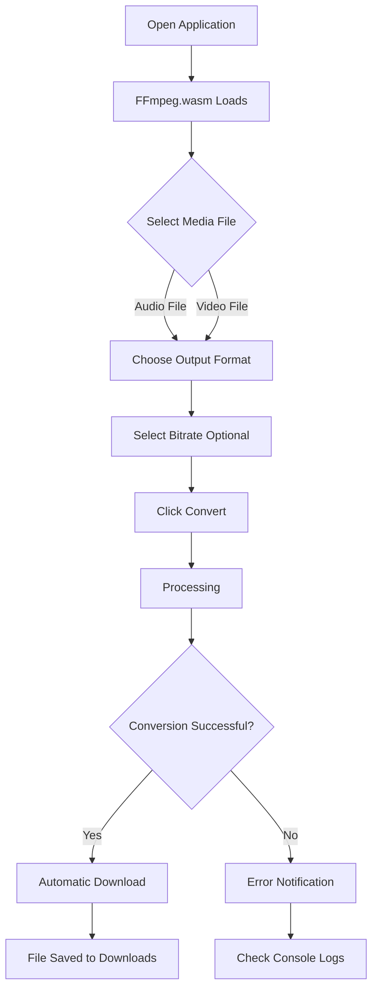
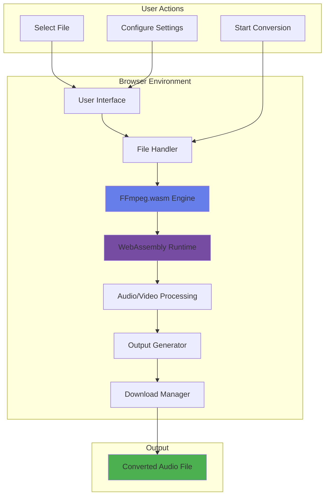

# 🎵 xsukax Audio Converter

A powerful, privacy-focused browser-based audio converter that enables users to convert audio files and extract audio from video files entirely within their web browser. No uploads, no server processing, no data collection—just pure client-side audio conversion powered by FFmpeg.wasm.

[](https://www.gnu.org/licenses/gpl-3.0)
[](https://github.com/ffmpegwasm/ffmpeg.wasm)

## 🔒 Security and Privacy Benefits

The xsukax Audio Converter prioritizes user privacy and data security through its architecture and implementation:

### Complete Client-Side Processing
- **Zero Server Uploads**: All file processing occurs entirely within your browser using WebAssembly technology. Your media files never leave your device, eliminating the risk of data interception during transmission or unauthorized access on remote servers.

### No Data Collection
- **Privacy by Design**: The application does not collect, store, or transmit any user data, metadata, or analytics. There are no tracking scripts, cookies, or telemetry systems monitoring your activity.

### Offline Capability
- **Air-Gapped Operation**: Once the FFmpeg.wasm library is loaded and cached, the application can function completely offline, providing an additional layer of security for sensitive media processing.

### Open Source Transparency
- **Auditable Code**: The entire codebase is publicly available for security audits and code review, ensuring transparency and allowing the community to verify that no malicious code or data exfiltration mechanisms exist.

### Local File System Access
- **Sandboxed Environment**: Files are processed in the browser's sandboxed environment with no persistence beyond the conversion session. Once you close the browser tab, all temporary data is automatically cleared.

## ✨ Features and Advantages

- **🌐 Browser-Based**: No installation required—works directly in modern web browsers (Chrome, Firefox, Edge, Safari)
- **🎬 Dual Functionality**: Convert audio files between formats AND extract audio tracks from video files
- **📁 Wide Format Support**: 
  - Audio: MP3, WAV, FLAC, AAC, OGG, M4A, WMA, OPUS
  - Video: MP4, AVI, MKV, MOV, WebM, FLV, WMV, MPG, MPEG
- **⚙️ Customizable Quality**: Select audio bitrate for compressed formats (64k to 320k)
- **🖱️ Drag-and-Drop Interface**: Intuitive file selection with drag-and-drop support
- **📊 Real-Time Progress**: Live conversion progress tracking with percentage and status updates
- **🎨 Modern UI**: Beautiful, responsive design with gradient themes and smooth animations
- **📝 Console Logging**: Detailed conversion logs for debugging and transparency
- **🔔 Smart Notifications**: Visual feedback for success, errors, and warnings
- **⚡ Fast Processing**: Leverages WebAssembly for near-native performance
- **🆓 Completely Free**: No subscriptions, no hidden fees, no feature limitations

## 📋 Requirements

### Browser Compatibility
- **Chrome/Edge**: Version 90 or higher
- **Firefox**: Version 88 or higher
- **Safari**: Version 14.1 or higher
- **Opera**: Version 76 or higher

### System Requirements
- **RAM**: Minimum 2GB available memory (4GB recommended for large video files)
- **Internet Connection**: Required for initial load to fetch FFmpeg.wasm library (approximately 25MB)

## 🚀 Installation Instructions

### Option 1: Direct Usage (Recommended)
Visit the live application directly—no installation needed:
```
https://xsukax.github.io/xsukax-Audio-Converter/
```

### Option 2: Self-Hosting

1. **Clone the Repository**
   ```bash
   git clone https://github.com/xsukax/xsukax-Audio-Converter.git
   cd xsukax-Audio-Converter
   ```

2. **Deploy the Files**
   
   Simply serve the `index.html` file using any web server:

   **Using Python's Built-in Server:**
   ```bash
   # Python 3
   python -m http.server 8000
   
   # Python 2
   python -m SimpleHTTPServer 8000
   ```

   **Using Node.js (http-server):**
   ```bash
   npx http-server -p 8000
   ```

   **Using PHP:**
   ```bash
   php -S localhost:8000
   ```

3. **Access the Application**
   
   Open your browser and navigate to:
   ```
   http://localhost:8000
   ```

### Option 3: GitHub Pages Deployment

1. Fork the repository on GitHub
2. Navigate to repository Settings → Pages
3. Select the main branch as the source
4. Your converter will be available at: `https://[your-username].github.io/xsukax-Audio-Converter/`

## 📖 Usage Guide

### Basic Workflow



### Step-by-Step Instructions

#### 1. Load the Application
- Open the application in your web browser
- Wait for FFmpeg.wasm to load (indicated by a success notification)
- The console will display "FFmpeg loaded and ready!"

#### 2. Select Your Media File
Choose one of the following methods:
- **Click**: Click the upload area and browse for your file
- **Drag & Drop**: Drag a file from your file manager directly onto the upload area

#### 3. Configure Output Settings
- **Format Selection**: Choose your desired audio output format from the dropdown menu
  - MP3: Best compatibility across all devices
  - AAC: High quality with smaller file sizes
  - WAV/FLAC: Lossless audio quality
  - OGG: Open-source format with good compression
  - M4A: Apple ecosystem compatibility
  
- **Bitrate Selection** (for compressed formats):
  - 320k: Maximum quality
  - 192k: Balanced quality/size (recommended)
  - 128k: Standard quality
  - Lower bitrates: For speech or when file size is critical

#### 4. Convert
- Click the "🔄 Convert to Audio" button
- Monitor the progress bar and console output
- The converted file will automatically download when complete

#### 5. Locate Your File
- Check your browser's default download location
- The file will be named: `[original-filename].[new-format]`

### Application Architecture



### Advanced Usage Tips

**For Large Video Files:**
- Ensure sufficient RAM is available (close unnecessary browser tabs)
- Be patient during the conversion process—large files may take several minutes
- Monitor the console for detailed progress information

**For Batch Processing:**
- Convert files one at a time for optimal performance
- Use browser bookmarks to quickly access the tool repeatedly

**For Best Quality:**
- Use WAV or FLAC formats for lossless audio extraction
- Select the highest bitrate (320k) for compressed formats
- Consider the source quality—upsampling won't improve poor source audio

## 🛠️ Technical Stack

- **Frontend**: Pure HTML5, CSS3, and Vanilla JavaScript
- **Audio Processing**: FFmpeg.wasm v0.11.6
- **Core Engine**: FFmpeg Core v0.11.1
- **UI Framework**: Custom CSS with gradient design system
- **Icons**: Unicode emoji characters
- **Architecture**: Single-page application (SPA)

## 🔧 Troubleshooting

### FFmpeg Loading Fails
**Issue**: "Failed to load FFmpeg" error appears
**Solutions**:
- Check your internet connection
- Clear browser cache and reload
- Try a different browser
- Disable browser extensions that might block WebAssembly

### Conversion Fails
**Issue**: Error during file processing
**Solutions**:
- Verify the file is not corrupted
- Ensure the file format is supported
- Try a different output format
- Check the console for specific error messages
- Reduce file size if memory issues are suspected

### Slow Performance
**Issue**: Conversion takes a very long time
**Causes & Solutions**:
- Large file size → Consider compressing the input file first
- Low system RAM → Close other applications and browser tabs
- Browser limitations → Try Chrome or Edge for best WebAssembly performance

### Downloaded File Won't Play
**Issue**: Output file doesn't play in media player
**Solutions**:
- Try a different media player (VLC is recommended)
- Verify the conversion completed successfully (check console)
- Re-convert using a more compatible format (MP3)

## 🤝 Contributing

Contributions are welcome! To contribute:

1. Fork the repository
2. Create a feature branch (`git checkout -b feature/AmazingFeature`)
3. Commit your changes (`git commit -m 'Add some AmazingFeature'`)
4. Push to the branch (`git push origin feature/AmazingFeature`)
5. Open a Pull Request

Please ensure your code follows the existing style and includes appropriate comments.

## 📄 License

This project is licensed under the GNU General Public License v3.0.

## 👨‍💻 Developer

Developed with ❤️ by [xsukax](https://github.com/xsukax)

## 🙏 Acknowledgments

- [FFmpeg.wasm](https://github.com/ffmpegwasm/ffmpeg.wasm) - WebAssembly port of FFmpeg
- [FFmpeg](https://ffmpeg.org/) - The underlying multimedia framework
- The open-source community for inspiration and support

## 📞 Support

- **Issues**: [GitHub Issues](https://github.com/xsukax/xsukax-Audio-Converter/issues)
- **Discussions**: [GitHub Discussions](https://github.com/xsukax/xsukax-Audio-Converter/discussions)

---

⭐ If you find this project useful, please consider giving it a star on GitHub!
